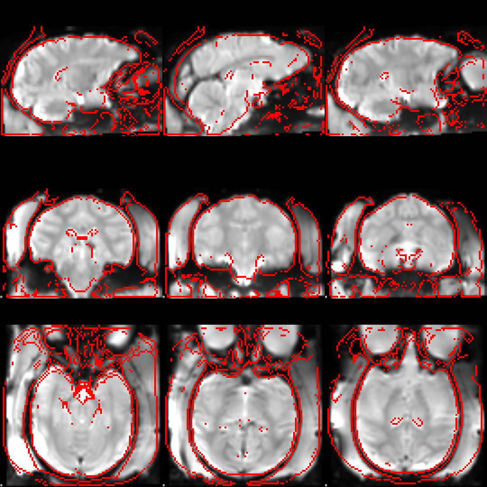
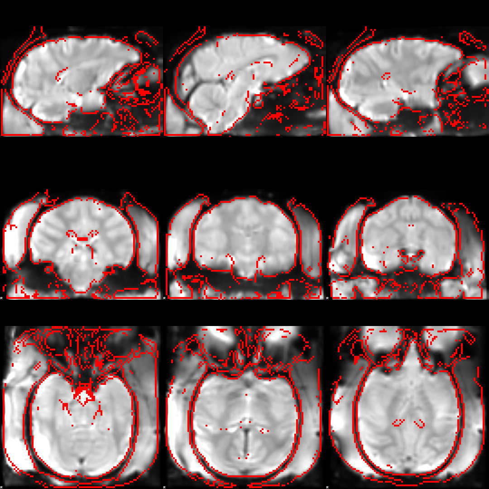

I have had success with the following configuration file. Note that FLIRT should use the skull stripped images, but the FNIRT
does better with the full brain images. You may want to try using using something like this: `--applyrefmask/applyinmask=0,0,0,1,1`
with the brainmasks, although just not using the mask seems to work fairly well. See below for example.

    # Started from https://www.jiscmail.ac.uk/cgi-bin/webadmin?A2=fsl;3014b260.1309
    #       If =1, use implicit masking based on value in --ref image. Default =1
    --imprefm=1
    #       If =1, use implicit masking based on value in --in image, Default =1
    --impinm=1
    #       Value to mask out in --ref image. Default =0.0
    --imprefval=0
    #       Value to mask out in --in image. Default =0.0
    --impinval=0
    #       sub-sampling scheme, default 4,2,1,1
    --subsamp=4,2,1,1,1
    #       Max # of non-linear iterations, default 5,5,5,5
    --miter=5,5,5,5,10
    #       FWHM (in mm) of gaussian smoothing kernel for input volume, default 6,4,2,2
    --infwhm=4,2,0,0,0
    #       FWHM (in mm) of gaussian smoothing kernel for ref volume, default 4,2,0,0
    --reffwhm=4,2,0,0,0
    #       Weigth of membrane energy regularisation, default depending on --ssqlambda and --regmod switches. See user documetation.
    --lambda=250,120,40,30,20
    #       Estimate intensity-mapping if set, deafult 1 (true)
    --estint=1,1,1,1,0
    #       Apply the mask if set, default 1 (true)
    --applyrefmask=1
    #       Apply the mask if set, default 1 (true)
    --applyinmask=1
    #       (approximate) resolution (in mm) of warp basis in x-, y- and z-direction, default 10,10,10
    --warpres=5,5,5
    #       If set (=1), lambda is weighted by current ssq, default 1
    --ssqlambda=1
    #       Model for regularisation of warp-field [membrane_energy bending_energy], default bending_energy
    --regmod=bending_energy
    #       Model for intensity-mapping [none global_linear global_non_linear local_linear global_non_linear_with_bias local_non_linear]
    --intmod=global_non_linear_with_bias
    #       Order of poynomial for mapping intensities, default 5
    --intorder=5
    #       Resolution (in mm) of bias-field modelling local intensities, default 50,50,50
    --biasres=10,10,10
    #       Weight of regularisation for bias-field, default 10000
    --biaslambda=10000
    #       If =1, ref image is used to calculate derivatives. Default =0
    --refderiv=0
 
 The first step is to perform FLIRT:
 
 
 Then perform FNIRT (after making sure FLIRT result looks good):
 
 
 This example doesn't have B0 unwarping applied to the EPI.
